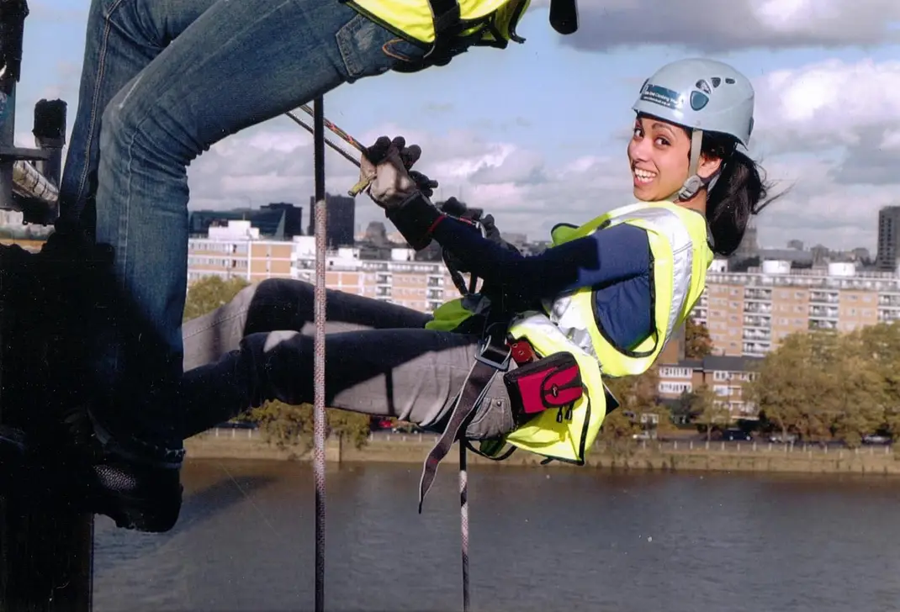

<h1 align="center">
  Sabirah Ahammed - Software Developer
</h1>

<!--  -->

## About Me
Full-stack Junior Software Developer with a background in Human Resources, specialising in Mental Health and Equity, Diversity & Inclusion (EDI). With over 12 years of experience, I have worked in large businesses to start-ups in the private, not-for-profit and charity sectors. I pride myself on building great relationships with clients, leading with empathy, patience and humour.

Realising that the majority of my career highlights were centred around using technology to create efficiencies and improve people's lives, I decided to make a drastic change and apply for an intensive coding skills bootcamp, securing a highly competitive scholarship with Makers Academy.

Having successfully completed the course, I am excited about finding a tech-forward company in which I can further enhance my engineering skills and make a real impact.

## Tech Languages and Frameworks
JavaScript | Ruby | Express | Cypress | RSpec | Jest | Node | Mongoose & MongoDB | SQL | Sinatra | React | Bootstrap | HTML | CSS

## Projects

| Project Repository | Description | Technologies |
| :----------------: |:----------: | :----------: |
| [Workout Buddy](https://github.com/Sabirah42/Workout-Buddy) | Web app that allows you to create an account and add your workouts (ongoing). | Mongoose, MongoDB, Express, Node, Javascript |
| [Blog](https://github.com/Sabirah42/React_Blog) | Small  project allowing you to create an online journal so I could further explore React. | React, Javascript |
| [Enaidle](https://github.com/nadiangelica/enaidle) | Enaidle grew out of an idea of building a community of people helping people. Working in an Agile way, we determined our MVP enabled charitable organisations to post their needs and for users to respond to these. | Mongoose, MongoDB, Express, Node, Javascrript, Bootstrap, Jest, Cypress |
| [Acebook](https://github.com/murat-zsertay/acebook-the-crown-jewels) | Social media platform allowing users to login, logout, create posts and make comments. This was my first time working with a legacy codebase and using the MERN stack. | Mongoose, MongoDB, Express, Node, Javascript, HTML, CSS, Jest, Cypress |
| [Makersbnb](https://github.com/tlchambers/makersbnb) | A listing and booking site. I learnt how to work in a team to deliver a presentable product on a very tight timeline. This is where I really got to grips with Github and learnt how to run my first ever stand-ups and retros. | Ruby, SQL, Sinatra, HTML, CSS, IRB, RSpec |

## Technical Experience
**Makers Academy - Software Engineering Bootcamp**  
*November 2022 - March 2023*

- Key focus on **Object-Oriented Programming**
- Implemented **Test-Driven Development** to ensure code was **DRY** and with fewer bugs on release
- Combined **Pair Programming** with solo work to produce best development outcomes
- **Code Reviewed** peers' projects, suggesting **refactoring** where required
- Employed **Agile** processes to deliver projects within tight timeframes
- Learnt how to use console logs and web developer tools to aid **Debugging**
- Integrated **Github** with **JIRA**, using **branch-based development** to ensure high levels of version control, communication and flexibility during group projects
- Through recommendations, asked to be a member of the alumni events committee. I organise regular tech socials and am currently in the process of setting up a mentorship scheme.
  
**Tom Teaches .Tech**  
*August - September 2022*

Short course designed to introduce learners to Frontend Fundamentals and design their own website.

## Work Experience
**Volunteer Website Engineer, Under One Sky**  
*April 2023 - present*

- Responsible for supporting the design and build of a charity website using Wordpress and Elementor Pro.

**Senior People Advisor, N Family Club**  
*December 2021 - July 2022*

- Within two weeks of joining, supported a junior team member to review the Payroll process and improve automation using systems reporting

- Lead on structural changes to case management, reducing average case completion time from 42 to 28 days

- Introduced and updated databases to reduce errors, improve efficiency and ensure the team were consistent in their approach

- Managed the transfer of acquisition site employees, including management of systems integration

- Generalist tasks including signing off on Payroll submissions and providing data to the Director of People for monthly board reports

- People Lead for the EDI Champion group
  
**HR Advisor (and Mental Health First Aider), Catalyst Housing Ltd**  
*September 2018 - November 2021*

- Highlighted technical errors in the HR Information System causing unfair pay for part-time workers, and held several meetings up to Director level in order to get this rectified

- Conducted Equality Impact Assessments, using data analysis to measure any effects of People policies on protected groups

- Partnered with the business to coach managers through challenging people issues, taking an active, preventative approach

- Proactively audited and brought policies in line with legal requirements
  
**Senior HR Advisor | HR Advisor | HR Team Administrator | HR Admin Assistant (and Equity, Diversity & Inclusion Champion), Together: For Mental Wellbeing**  
*October 2010 - September 2018*

Promoted throughout my time at Together, supporting over 60 national branches and 600+ employees.

- Automated timesheet process for all national branches, reducing time input for multiple departments (95% time reduction for HR Advisor role alone)

- Overhauled Payroll database, reducing monthly errors by 90% on average

- Identified and automated multiple manual processes, allowing a more senior role to be created for the team

- Managed key HR reporting systems and databases

- Used SQL reports to provide People data and trend analysis to Head of HR for quarterly board reports and annual government Gender Pay Gap report

- Maintained vacancies on company website using WordPress

- Deputised for Head of HR, including running the department during a long-term absence

- Worked in collaboration with the Head of HR to ensure effective rollout of and compliance with new General Data Protection Regulation (GDPR)

- Managed and mentored up to four HR Administration and Advisory staff

## Education
**University of the Arts London (LCC)**
- Diploma in Spatial Design

Designed spatial solutions tailored to address specific client problems and requirements. Translated these conceptual ideas into accurate digital representations using computer aided design (CAD) software.

**Burntwood School for Girls**
- 3 A-Levels (Maths, Photography, Product Design)
- 12 GCSEs (including Maths, Statistics, English and ICT)

**Key accomplishment:**  
Co-founded and led the Fairtrade Action Group, delivering impactful presentations to engage and educate an audience of over 1200 staff and students. Through campaigning efforts, eventually held meetings with the headteacher and successfully had our school catering contract revised to allow Fairtrade products to be sold in the school shop.

## Hobbies and Interests

:sauropod: Growing up loving dinosaurs, it only makes sense that I'm now a member of the Natural History Museum and frequent their exhibitions and events.

:tumbler_glass: I'm also part of a Women's Whisky Group and go to monthly talks (and tasters...) delivered by female brand ambassadors.

:climbing_woman: Mainly, I'm a believer in "try anything once", which has led me to a variety of activities including ice wall climbing, bachata and improv comedy!
